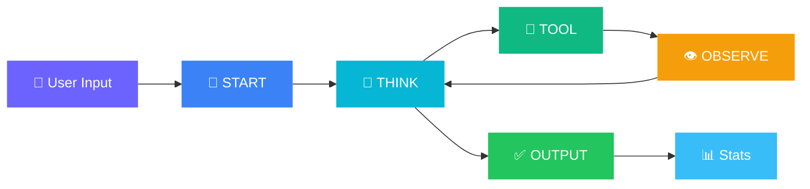

<div align="center">

<!-- Animated Header -->


<br/>

<!-- Typing Animation -->
<a href="https://git.io/typing-svg"></a>

<br/><br/>

<!-- Badges Row 1 -->
[](https://nodejs.org)
[](https://ai.google.dev)
[](https://developer.mozilla.org)
[](LICENSE)

<!-- Badges Row 2 -->
[](https://github.com/abdulkalamazad1001/agentforge-cli)
[](https://github.com/abdulkalamazad1001/agentforge-cli/fork)
[](https://github.com/abdulkalamazad1001/agentforge-cli/issues)

<br/>

<!-- Demo Video -->
<a href="https://youtu.be/OMpFaIxf8e4">
  
</a>

<br/><br/>

> **One prompt. One agent. One complete website.**
> 
> AgentForge is a conversational CLI agent that autonomously **thinks, plans, and builds** production-quality websites — all from a single text prompt in your terminal.

<br/>

</div>

---

## 🎬 See It In Action

```
  ▶ You: Clone the Scaler Academy website

  🚀 [START] [Step 1] Understanding your request...
     │  I will build a high-fidelity clone of the Scaler Academy website...

  🧠 [THINK] [Step 2] Reasoning...
     │  Let me plan the file structure. I'll need styles.css, index.html, script.js...

  🔧 [TOOL] [Step 3] Executing action...
     │  → createFile("output/styles.css") ✓ (6.4 KB)

  🔧 [TOOL] [Step 5] Executing action...
     │  → createFile("output/index.html") ✓ (8.2 KB)

  🔧 [TOOL] [Step 7] Executing action...
     │  → createFile("output/script.js") ✓ (3.1 KB)

  🔧 [TOOL] [Step 9] Executing action...
     │  → openInBrowser("output/index.html") ✓ Opened in browser

  ╭──────────────────── OUTPUT ────────────────────╮
  │  ✅ Task Complete!                              │
  │  Built: Header, Hero, Highlights, Curriculum,   │
  │  Footer — all responsive with animations.       │
  ╰─────────────────────────────────────────────────╯

  ╭──────────────── STATS ─────────────────╮
  │  📊 Session Summary                    │
  │  ⏱  Time Elapsed:   45.2s             │
  │  🔄 Steps Taken:    12                 │
  │  📁 Files Created:  3                  │
  │     • output/styles.css (6.4 KB)       │
  │     • output/index.html (8.2 KB)       │
  │     • output/script.js (3.1 KB)        │
  ╰────────────────────────────────────────╯
```

---

## ✨ What Makes This Special

<table>
<tr>
<td width="50%">

### 🧠 ReAct Reasoning Loop
The agent doesn't just generate code — it **thinks step by step**. Each response follows a structured `START → THINK → TOOL → OBSERVE → OUTPUT` loop, making every decision transparent and debuggable.

</td>
<td width="50%">

### 🔁 Round-Robin Load Balancing
Supports **multiple API keys** with automatic rotation. The agent cycles through your key pool on every request, maximizing throughput and minimizing rate limit hits.

</td>
</tr>
<tr>
<td width="50%">

### 🛡️ Self-Healing Retry System
**10 automatic retries** with exponential backoff (5s → 30s). The agent never crashes from rate limits — it patiently waits and retries with a visual progress indicator.

</td>
<td width="50%">

### 📊 Real-Time Session Stats
After every task, see a detailed summary: time elapsed, steps taken, files created with sizes. Know exactly what the agent built and how long it took.

</td>
</tr>
<tr>
<td width="50%">

### 🎨 Stunning Terminal UI
Gradient ASCII art, color-coded reasoning steps, animated spinners, boxed outputs — this isn't your average CLI tool. It's a visual experience.

</td>
<td width="50%">

### 🔒 Safe by Design
Only 3 whitelisted tools: `createFile`, `createDirectory`, `openInBrowser`. No shell access, no system commands. The agent can only create files in the `output/` folder.

</td>
</tr>
</table>

---

## 🏗️ System Architecture

```
                    ┌──────────────────────────────────────────────┐
                    │              AgentForge CLI v2.0             │
                    │         Built by Abdul Kalam Azad            │
                    └──────────────────┬───────────────────────────┘
                                       │
                    ┌──────────────────▼───────────────────────────┐
                    │             index.js (Agent Core)            │
                    │                                              │
                    │  ┌─────────────┐  ┌────────────────────┐    │
                    │  │  Readline   │  │  Round-Robin Key    │    │
                    │  │  Interface  │  │  Load Balancer      │    │
                    │  └──────┬──────┘  └────────┬───────────┘    │
                    │         │                  │                 │
                    │  ┌──────▼──────────────────▼───────────┐    │
                    │  │         ReAct Reasoning Loop         │    │
                    │  │                                      │    │
                    │  │  START ──▶ THINK ──▶ TOOL ──▶ OUTPUT │    │
                    │  │              ▲         │             │    │
                    │  │              └─ OBSERVE ┘             │    │
                    │  └──────────────────┬──────────────────┘    │
                    └─────────────────────┼───────────────────────┘
                                          │
              ┌───────────────────────────┼───────────────────────────┐
              │                           │                           │
    ┌─────────▼─────────┐    ┌───────────▼──────────┐    ┌──────────▼──────────┐
    │    prompts.js      │    │      tools.js         │    │      ui.js          │
    │                    │    │                       │    │                     │
    │  System Prompt     │    │  createFile()         │    │  Welcome Banner     │
    │  Scaler Design     │    │  createDirectory()    │    │  Step Display       │
    │  Knowledge Base    │    │  openInBrowser()      │    │  Session Stats      │
    │  Tool Descriptions │    │  executeTool()        │    │  Gradients/Spinners │
    └────────────────────┘    └───────────────────────┘    └─────────────────────┘
```

---

## 🔄 The ReAct Loop — How It Thinks



| Step | Icon | Purpose | What You See |
|:-----|:----:|:--------|:-------------|
| **START** | 🚀 | Acknowledge & plan | Blue banner with task summary |
| **THINK** | 🧠 | Reason about next action | Cyan italic reasoning text |
| **TOOL** | 🔧 | Execute a file operation | Green tool name + arguments |
| **OBSERVE** | 👁️ | Process tool result | Amber result feedback |
| **OUTPUT** | ✅ | Deliver final result | Green boxed completion message |
| **STATS** | 📊 | Show session metrics | Blue stats summary box |

---

## 🛠️ Available Tools

The agent has access to **3 purpose-built, safe tools**:

```javascript
// 📄 Create a file with content
createFile("output/index.html", "<html>...</html>")
// → "File created successfully: output/index.html (8.2 KB)"

// 📁 Create a directory
createDirectory("output/assets")
// → "Directory created successfully: output/assets"

// 🌐 Open in browser
openInBrowser("output/index.html")
// → "Opened output/index.html in the default browser successfully"
```

> 💡 **Why only 3 tools?** Instead of giving the agent a dangerous `executeCommand` tool that could run anything, we provide **specific, safe tools**. This makes the agent reliable and prevents accidental system damage.

---

## 🚀 Quick Start

### Prerequisites

| Requirement | Version |
|:------------|:--------|
| **Node.js** | 18+ |
| **npm** | 9+ |
| **Gemini API Key** | [Get one free →](https://aistudio.google.com/apikey) |

### Installation

```bash
# Clone the repository
git clone https://github.com/abdulkalamazad1001/agentforge-cli.git

# Navigate to the project
cd agentforge-cli

# Install dependencies
npm install

# Configure your API key(s)
echo "GEMINI_API_KEYS=your-key-here" > .env

# For multiple keys (Round-Robin load balancing):
echo "GEMINI_API_KEYS=key1,key2,key3" > .env

# Launch AgentForge
npm start
```

### CLI Commands

| Command | Action |
|:--------|:-------|
| `Clone the Scaler Academy website` | Build a full website clone |
| `Build a portfolio with dark mode` | Create a custom website |
| `help` | Show available commands |
| `clear` | Clear the terminal |
| `exit` / `quit` / `q` | Exit AgentForge |

---

## 🎨 Generated Website Features

When asked to clone the Scaler Academy website, the agent generates:

| Section | Features |
|:--------|:---------|
| 📌 **Top Contact Bar** | Dark gradient with phone number and CTA |
| 🧭 **Sticky Header** | White navbar with logo, nav links, mobile hamburger |
| 🦸 **Hero Section** | Animated gradient, floating orbs, glassmorphic form |
| 📋 **Course Overview** | 3 informational cards with shadow effects |
| ⭐ **Key Highlights** | 6 colorful animated cards with hover effects |
| 💼 **Advisor CTA** | Dark section with benefits checklist |
| 📚 **Curriculum** | Interactive tab switcher (Beginner/Intermediate/Advanced) |
| 🔗 **Footer** | Dark footer with links, socials, copyright |

**Design Quality:** Responsive • CSS Animations • Google Fonts • Pixel-perfect colors

---

## 🧰 Tech Stack

<div align="center">

| Technology | Purpose | Why |
|:-----------|:--------|:----|
|  | Runtime | Fast, async, perfect for CLI tools |
|  | AI Engine | Latest reasoning model with free tier |
|  | Terminal Colors | Rich, 256-color terminal output |
|  | Spinners | Smooth animated loading indicators |
|  | Boxes | Styled terminal boxes for output |
|  | Gradients | Multi-color gradient text effects |
|  | Config | Secure environment variable management |

</div>

---

## 📁 Project Structure

```
AgentForge CLI/
│
├── 📄 index.js          # Agent core — ReAct loop, Round-Robin balancer, retry logic
│                         # ~400 lines │ @author Abdul Kalam Azad
│
├── 📄 prompts.js         # System prompt — Scaler design knowledge, tool descriptions
│                         # ~180 lines │ @author Abdul Kalam Azad
│
├── 📄 tools.js           # Safe toolset — createFile, createDirectory, openInBrowser
│                         # ~190 lines │ @author Abdul Kalam Azad
│
├── 📄 ui.js              # Terminal UI — gradients, spinners, stats, step display
│                         # ~380 lines │ @author Abdul Kalam Azad
│
├── 📄 package.json       # Dependencies and scripts
├── 📄 .env               # API keys (git-ignored)
├── 📄 .gitignore          # Excludes .env, node_modules, output/
└── 📄 README.md          # You are here
```

---

## ⚡ Resilience Engineering

<details>
<summary><b>🔁 Round-Robin API Key Pool</b> — Click to expand</summary>
<br/>

```javascript
// Supports N keys via comma-separated env var
const apiKeys = process.env.GEMINI_API_KEYS.split(",");
let currentKeyIndex = 0;

// Every API call rotates to the next key
const activeKey = apiKeys[currentKeyIndex];
currentKeyIndex = (currentKeyIndex + 1) % apiKeys.length;
```

- Each key gets its own `GoogleGenerativeAI` client instance
- Global conversation history persists across key switches
- Zero context loss during rotation

</details>

<details>
<summary><b>🛡️ Exponential Backoff Retry</b> — Click to expand</summary>
<br/>

```
Attempt 1  → Wait  5s  [█░░░░░░░░░]
Attempt 2  → Wait 10s  [██░░░░░░░░]
Attempt 3  → Wait 15s  [███░░░░░░░]
Attempt 4  → Wait 20s  [████░░░░░░]
Attempt 5  → Wait 25s  [█████░░░░░]
Attempt 6+ → Wait 30s  [██████░░░░]  (capped)
```

- **10 retries** cover a full ~2.5 minute rate limit window
- Auth errors (401/403) fail fast — no wasted retries
- Visual progress bar shown to user during waits

</details>

<details>
<summary><b>🧠 JSON Recovery Parser</b> — Click to expand</summary>
<br/>

LLMs sometimes return malformed JSON. Our 4-strategy parser handles it all:

1. **Direct parse** — Try `JSON.parse()` first
2. **Code block extraction** — Strip ````json` wrappers
3. **Regex extraction** — Find `{...}` blocks in mixed text
4. **Auto-fix** — Remove trailing commas, fix quote types

</details>

---

## 🎬 Demo

<div align="center">

[](https://youtu.be/PbHSliZI4iQ)

*2-3 minute walkthrough showing the agent running live and the generated website*

</div>

---

## 📝 License

This project is licensed under the **MIT License** — see the [LICENSE](LICENSE) file for details.

---

<div align="center">

<br/>

**Built with ❤️ by Abdul Kalam Azad**

*For Scaler Academy — GenAI Assignment*

<br/>

[](https://github.com/abdulkalamazad1001)

<br/>


</div>
